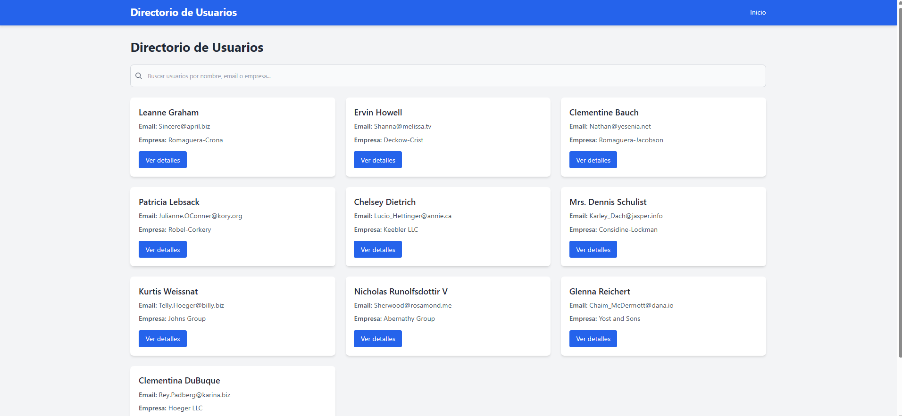
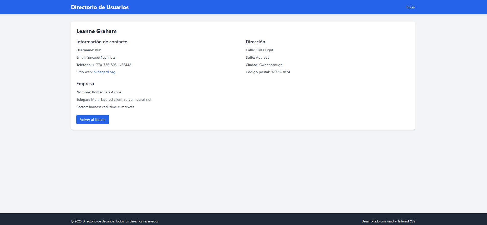
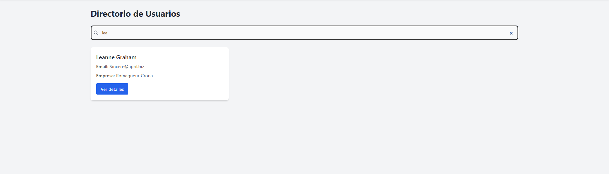

# Directorio de Usuarios

Aplicación web desarrollada en React que muestra un directorio de usuarios consumiendo la API de JSONPlaceholder.

## Instalación y Ejecución

1. Clona este repositorio:
   ```bash
   git clone https://github.com/tu-usuario/directorio-usuarios.git
   ```

2. Navega al directorio del proyecto:
   ```bash
   cd directorio-usuarios
   ```

3. Instala las dependencias:
   ```bash
   npm install
   ```

4. Inicia la aplicación en modo desarrollo:
   ```bash
   npm start
   ```

5. Abre [http://localhost:3000](http://localhost:3000) en tu navegador para ver la aplicación.

## API y Consumo de Datos

Esta aplicación consume la API de [JSONPlaceholder](https://jsonplaceholder.typicode.com/), un servicio gratuito que proporciona datos de prueba.

### Endpoints Utilizados

- **GET /users**: Obtiene la lista completa de usuarios
  ```javascript
  const response = await axios.get('https://jsonplaceholder.typicode.com/users');
  ```

- **GET /users/{id}**: Obtiene los detalles de un usuario específico
  ```javascript
  const response = await axios.get(`https://jsonplaceholder.typicode.com/users/${userId}`);
  ```

### Manejo de Datos

Los datos se consumen mediante Axios en el archivo `src/services/api.js`:

```javascript
import axios from 'axios';

const api = axios.create({
  baseURL: 'https://jsonplaceholder.typicode.com'
});

export const getUsers = async () => {
  try {
    const response = await api.get('/users');
    return response.data;
  } catch (error) {
    throw error;
  }
};

export const getUserById = async (id) => {
  try {
    const response = await api.get(`/users/${id}`);
    return response.data;
  } catch (error) {
    throw error;
  }
};
```

### Estructura de Datos

Cada usuario tiene la siguiente estructura:

```json
{
  "id": 1,
  "name": "Leanne Graham",
  "username": "Bret",
  "email": "Sincere@april.biz",
  "address": {
    "street": "Kulas Light",
    "suite": "Apt. 556",
    "city": "Gwenborough",
    "zipcode": "92998-3874",
    "geo": {
      "lat": "-37.3159",
      "lng": "81.1496"
    }
  },
  "phone": "1-770-736-8031 x56442",
  "website": "hildegard.org",
  "company": {
    "name": "Romaguera-Crona",
    "catchPhrase": "Multi-layered client-server neural-net",
    "bs": "harness real-time e-markets"
  }
}
```

## Tecnologías Utilizadas

- **React** - Biblioteca principal para la interfaz de usuario
- **React Router** - Manejo de navegación entre páginas
- **Context API** - Gestión del estado global de la aplicación
- **Axios** - Cliente HTTP para consumo de APIs
- **Tailwind CSS** - Framework CSS para estilos
- **PostCSS** - Procesamiento de estilos CSS


## Capturas de Pantalla






